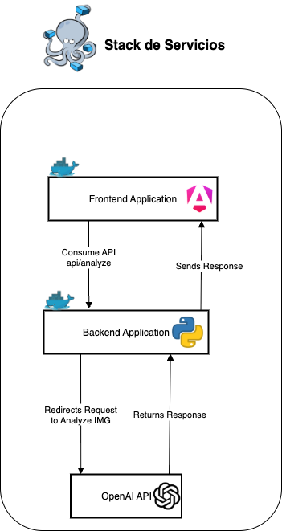

<div align="center">

# Image Analyzer

Aplicación full-stack para analizar imágenes con la OpenAI Responses API. El usuario sube una imagen (drag & drop) y recibe una descripción estructurada.

</div>

## Tabla de Contenido
1. Objetivos
2. Arquitectura
3. Tecnologías
4. Variables de Entorno
5. Backend
6. Frontend
7. Flujo
8. Endpoints
9. Docker Compose
10. Prompts
11. Contacto

---

## 1. Objetivos
- Subir imágenes y validarlas rápidamente.
- Obtener descripción y etiquetas estructuradas vía OpenAI.
- Cambiar el prompt sin modificar código usando `PROMPT_KEY`.

## 2. Arquitectura


Dos servicios en docker-compose: `api` (Flask) y `frontend` (Angular compilado + Nginx). El frontend se ejecuta en el navegador, por eso la URL del backend está fija a `http://localhost:8000` (no requiere red interna especial para la llamada desde el browser).

## 3. Tecnologías
Backend: Python 3.12, Flask 3, SDK `openai`, CORS.

Frontend: Angular 18 (standalone + Signals), TypeScript, Nginx (servido estático).

Infra: Docker multi-stage (Angular build) y docker-compose.

## 4. Variables de Entorno
Solo se documentan las usadas funcionalmente por la aplicación:

| Variable | Descripción |
|----------|-------------|
| `OPENAI_API_KEY` | Clave de OpenAI (requerida). |
| `OPENAI_MODEL` | Modelo a usar (ej: `gpt-4o-mini`). |
| `PROMPT_KEY` | Clave que selecciona el prompt dentro de `prompts.json`. |

Ejemplo `.env`:
```
OPENAI_API_KEY=sk-xxxxx
OPENAI_MODEL=gpt-4o-mini
PROMPT_KEY=analyze_img_v5
```

## 5. Backend
Ubicación: `backend/`.
- `app/routes/upload.py`: endpoint `/api/analyze`.
- `app/services/openai.py`: llamada a Responses API.
- `app/validation.py`: validación de formato con `imghdr`.
- `prompts.json`: catálogo de prompts.

## 6. Frontend
Ubicación: `frontend/image-analyzer-frontend/`.
- Servicio `image-analyzer.service.ts` llama a `http://localhost:8000/api/analyze`.
- Parseo del JSON devuelto (descripcion, labels).
- Imagen de fondo en `assets/background.jpg`.

## 7. Flujo
1. Usuario selecciona/arrastra imagen.
2. POST multipart a `/api/analyze` con campo `file`.
3. Backend valida formato y tamaño, codifica Base64 y consulta OpenAI.
4. Respuesta JSON (o mensaje de error de análisis) vuelve al frontend.
5. Frontend renderiza descripción y etiquetas.

## 8. Endpoints
| Método | Ruta | Descripción |
|--------|------|-------------|
| GET | `/health` | Comprobación simple. |
| POST | `/api/analyze` | Analiza una imagen enviada en `file`. |

## 9. Docker Compose
Requisitos: Docker + docker-compose.
```
cp .env.example .env
# Editar .env con tu OPENAI_API_KEY y modelo
docker compose build
docker compose up -d
curl http://localhost:8000/health
```
Frontend: http://localhost (puerto 80)
API: http://localhost:8000

Logs:
```
docker compose logs -f api
docker compose logs -f frontend
```
Detener:
```
docker compose down
```

## 10. Prompts
Editar `backend/app/routes/prompts.json` y cambiar `PROMPT_KEY` en `.env` para seleccionar otro. Cada entrada debe devolver JSON coherente para que el frontend lo parsee.

## 11. Contacto
GitHub: [andrewrv43](https://github.com/andrewrv43)
LinkedIn: [Andrew Paul Rueda Valencia](https://www.linkedin.com/in/andrew-paul-rueda-valencia/)

---